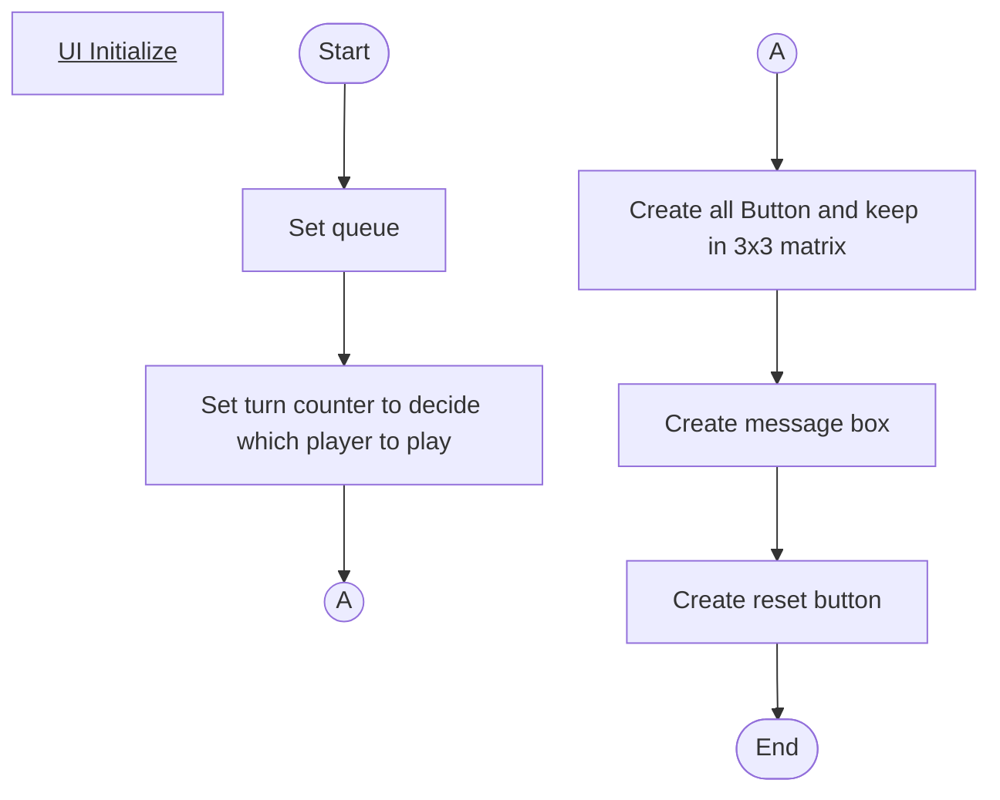
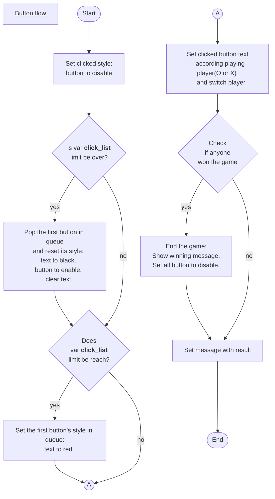
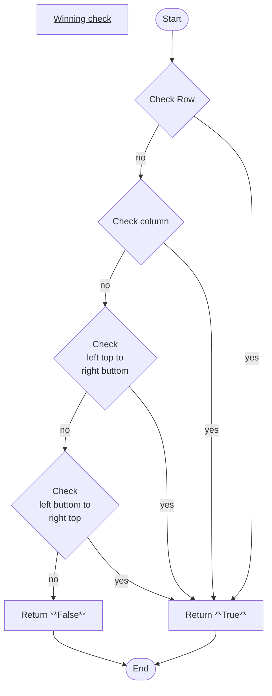
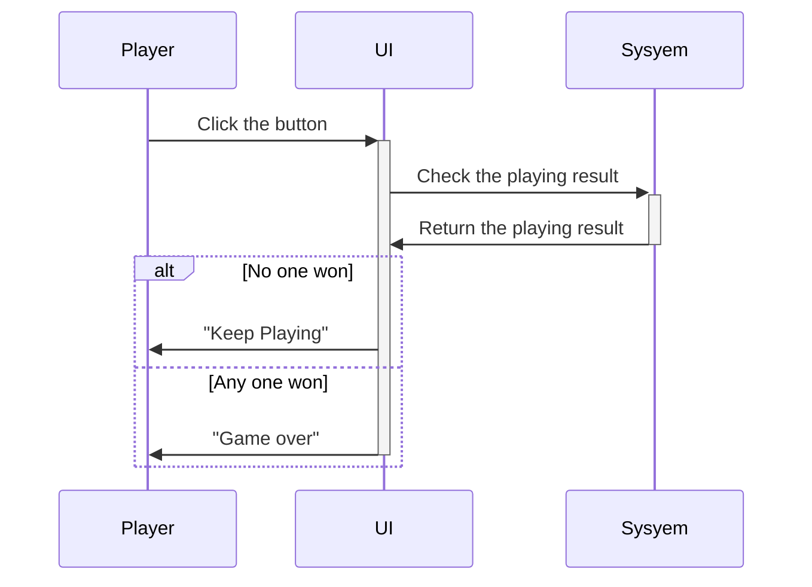
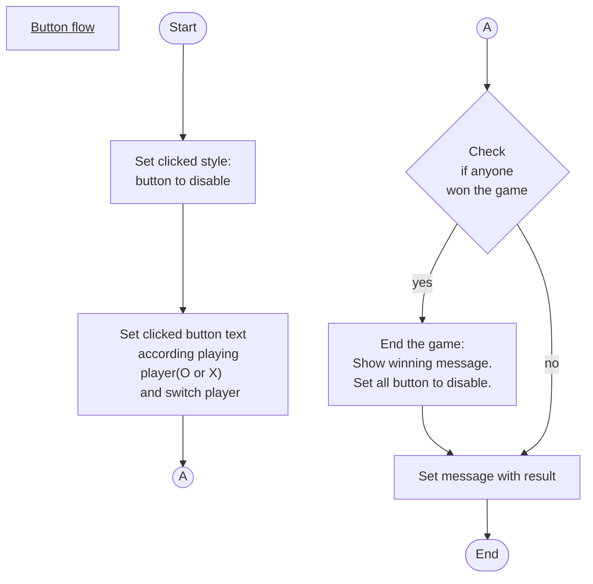

## gif

## flowchart

```mermaid
flowchart TD
    title[<u>UI Initialize</u>]
    st(["Start"])
    conn-A-1((A))
    op-1["Set queue"]
    op-2["Set turn counter to decide which player to play"]
    op-3["Create all Button and keep in 3x3 matrix"]
    op-4["Create message box"]
    op-5["Create reset button"]
    conn-A-2((A))
    ed(["End"])
    
    st --> op-1 --> op-2 --> conn-A-1
    conn-A-2 --> op-3 --> op-4 --> op-5 --> ed
```

```mermaid
flowchart TD
    title[<u>Button flow</u>]
    st(["Start"])
    conn1((A))
    conn2((A))
    op-2["Set clicked style:
    button to disable"]
    cond-1{"`is var **click_list** 
    limit be over?`"}
    op-3["Pop the first button in queue
    and reset its style:
    text to black,
    button to enable,
    clear text"]
    cond-2{"`Does 
    var **click_list** 
    limit be reach?`"}
    op-4["Set the first button's style in queue:
    text to red"]
    op-5["Set clicked button text
    according playing player(O or X) 
    and switch player"]
    cond-3{"Check
    if anyone 
    won the game"}
    op-6["End the game:
    Show winning message.
    Set all button to disable."]
    op-7["Set message with result"]
    ed(["End"])
    
    st --> op-2 --> cond-1 -- yes --> op-3 --> cond-2 -- yes --> op-4 --> conn1
    conn2 --> op-5 --> cond-3 -- yes --> op-6 --> op-7 --> ed
    cond-1 -- no --> cond-2
    cond-2 -- no --> conn1
    cond-3 -- no --> op-7
```

```mermaid
flowchart TD
    title[<u>Winning check</u>]
    st(["Start"])
    cond-1{"Check Row"}
    cond-2{"Check column"}
    cond-3{"Check 
    left top to 
    right buttom"}
    cond-4{"Check 
    left buttom to
    right top"}
    op-1["Return **True**"]
    op-2["Return **False**"]
    ed(["End"])
    
    st --> cond-1 -- no --> cond-2 -- no --> cond-3 -- no --> cond-4 -- no --> op-2 --> ed
    cond-1 -- yes --> op-1
    cond-2 -- yes --> op-1
    cond-3 -- yes --> op-1
    cond-4 -- yes --> op-1
    op-1 --> ed
```

## Sequence Diagram

```mermaid
sequenceDiagram
    Player->>+UI: Click the button
    UI->>+Sysyem: Check the playing result
    Sysyem->>-UI: Return the playing result
    alt No one won
        UI->>Player: "Keep Playing"
    else Any one won
        UI->>-Player: "Game over"
    end
```
    
## flowchart - original
    

```mermaid
flowchart TD
    title[<u>Button flow</u>]
    st(["Start"])
    conn1((A))
    conn2((A))
    op-2["Set clicked style:
    button to disable"]
    op-5["Set clicked button text
    according playing player(O or X) 
    and switch player"]
    cond-3{"Check
    if anyone 
    won the game"}
    op-6["End the game:
    Show winning message.
    Set all button to disable."]
    ed(["End"])
    op-7["Set message with result"]
    
    st --> op-2 --> op-5 --> conn1
    conn2  --> cond-3 -- yes --> op-6 --> op-7 --> ed
    cond-3 -- no --> op-7
```
